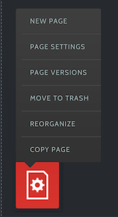
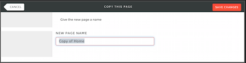

# Apostrophe-Copypage #

Plugin for the [apostrophe-cms](http://apostrophenow.org) to easy copy an entire page.

## Install ##

```
npm install apostrophe-copypage --save
```

## Configuration ##

Set the default new page name into the configuration

```
{
	  'new-pagename': 'Copy of $1'
}
```

That's it.

## How It Works ##

A new menu item in the context menu appears "Copy page". 


By clicking the item a model will asks for the new page name.


Saving the form will create a new page that is set unpublished. 

## Disclaimer ##

This module is in a very early state. Not well tested and used for our special purpose to  copy a entre page quickly. 
